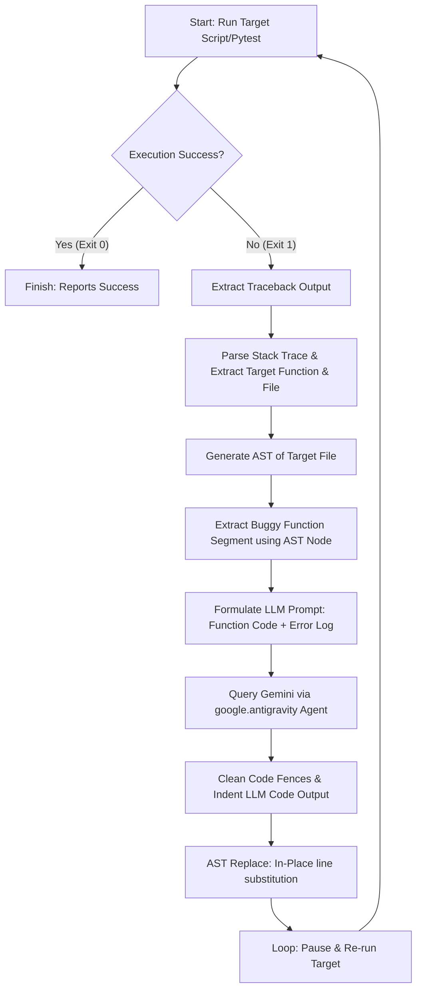

# AST-Healer

[](#)
[](#)
[](#)
[](#)

AST-Healer is an autonomous, self-healing developer tool and web service built using the `google.antigravity` SDK and Gemini. It executes target code files or test suites, captures runtime tracebacks, automatically parses exception stack frames to isolate buggy function blocks using Python's native Abstract Syntax Tree (`ast`), repairs the target code via Gemini 1.5 Flash, and verifies the healed code inside an isolated sandbox loop.

---

## 📽️ Demo & Screenshots


> [!NOTE]
> *Demo videos, UI dashboards, and full API execution screencasts are located under assets.*

*   **API Interactive Documentation Dashboard:** [Link to Screenshot Placeholder]
*   **Sequential Healing Loop Terminal Screencast:** [Link to Screencast Placeholder]

---

## 💡 Why This Project Exists

Traditional LLM-driven code repair utilities often send entire source code files or complete directories into the model's context window. This approach suffers from three major flaws:
1.  **High Token Cost:** Sending hundreds or thousands of lines of unrelated code wastes context tokens and increases API expenses.
2.  **Model Distraction:** Long context inputs degrade LLM attention, increasing the rate of hallucinations and incorrect edits.
3.  **Untargeted Modifications:** LLMs frequently edit unrelated parts of the file, introducing secondary bugs.

AST-Healer resolves this by surgically extracting *only* the specific syntax node representing the failing function block (`FunctionDef`). By localizing both the input and the replacement to the AST level, it minimizes token usage, focuses LLM attention, and prevents unwanted edits to surrounding code.

---

## 🚀 Key Features

*   **Surgical AST Isolation:** Traverses the Abstract Syntax Tree using Python's native `ast` parser to isolate only the target function definition and re-inserts corrected code blocks while preserving original indent levels.
*   **Closed-Loop Automated Healing:** Runs test suites or scripts, detects crashes, parses tracebacks to isolate the buggy target, heals it via Gemini, and re-verifies in a loop until all exceptions are resolved.
*   **Non-Blocking API Architecture:** Implements a FastAPI backend exposing a non-blocking `POST /heal/auto` endpoint that offloads healing tasks to an async background worker, returning a `202 Accepted` response immediately.
*   **Python Traceback Stack-Frame Parser:** Scans standard Python tracebacks backwards to isolate the innermost failing function frame, ignoring top-level module execution scopes (`"<module>"`).
*   **Production-Grade Dockerization:** Multi-stage Docker configuration utilizing a lightweight `python:3.11-slim` base image, running under a secure non-root user (`appuser`).
*   **Rate-Limit Mitigation:** Implements an asynchronous rate-limit pacing delay to prevent hitting API quotas (Requests Per Minute) on free-tier API keys.

---

## 🏗️ System Architecture

AST-Healer uses a closed-loop control system design to automate bug resolution:



### Engineering Design Choices
*   **AST-based Surgery vs. Regex Substitution:** Text-based search and replace is highly prone to failures (e.g. replacing duplicate helper function names elsewhere in the file). AST traversal guarantees that we target the exact scope of the function matching the failing identifier.
*   **Subprocess Sandbox Isolation:** Test suites and target files are run in a distinct Python subprocess, isolating the primary FastAPI runtime from exceptions and memory leaks caused by the target code.

---

## 🛠️ Tech Stack

| Component | Technology | Description |
| :--- | :--- | :--- |
| **Backend Framework** | FastAPI | Asynchronous REST API utilizing asyncio workers |
| **Server Runtime** | Uvicorn | ASGI server implementation |
| **Pydantic Validation** | Pydantic v2 | Strict JSON schema parser enforcing model constraints |
| **AI SDK** | google-antigravity | Google's agentic platform integration |
| **Code Parser** | Python `ast` | Native Python AST parser and line segment extractor |
| **Testing Sandbox** | Pytest | Programmatic test running and log generation |
| **Deployment** | Docker | Multi-stage, non-root, lightweight deployment configuration |
| **Dev Tools** | Python 3.11, Pip, dotenv | Environment isolation and package dependency management |

---

## 💾 Installation

### Prerequisites
*   Python 3.11+
*   Git

### Setup
1.  **Clone the Repository:**
    ```bash
    git clone https://github.com/imohi/AST-Healer.git
    cd AST-Healer
    ```

2.  **Initialize Virtual Environment:**
    ```bash
    python -m venv .venv
    # Windows (PowerShell)
    .venv\Scripts\Activate.ps1
    # macOS / Linux
    source .venv/bin/activate
    ```

3.  **Install Dependencies:**
    ```bash
    pip install -r requirements.txt
    ```

4.  **Configure Environment Variables:**
    Create a `.env` file in the root directory:
    ```env
    GEMINI_API_KEY=your_gemini_api_key_here
    ```

---

## 💻 Usage

### 1. Running the CLI Auto-Heal Demo
To run the automated healing loop directly in your terminal:
```bash
python main.py --mode script --target tests/mock_run.py --max-attempts 5
```

### 2. Launching the Web Service
To run the FastAPI server locally:
```bash
.venv\Scripts\python.exe -m uvicorn app:app
```
*(Do not use the `--reload` flag during self-healing executions, as code changes will trigger Uvicorn reloads, interrupting background tasks).*

Access the interactive API documentation at: **[http://localhost:8000/docs](http://localhost:8000/docs)**.

---

## 📁 Project Structure

```text
AST-Healer/
├── .env                  # API Credentials (ignored by git)
├── Dockerfile            # Multi-stage Docker config
├── app.py                # FastAPI endpoints and background worker tasks
├── main.py               # Core self-healing loop and traceback parsing logic
├── parser.py             # AST node extraction and replacement logic
├── schemas.py            # Pydantic v2 validation models
├── requirements.txt      # Project dependencies
└── tests/
    ├── mock_code.py      # Target codebase containing logic and runtime bugs
    ├── mock_run.py       # Standalone execution target script
    └── test_mock_code.py # Pytest validation test suite
```

---

## ⚡ Engineering Highlights

### 🚀 Scalability
*   **Non-Blocking Requests:** Ingestion endpoints (`POST /heal/auto`) immediately return a `202 Accepted` response with a task ID. Heavy LLM calling and subprocess execution are offloaded to background threads.
*   **Thread-Safe Task Tracking:** An in-memory task database tracks background process states, facilitating polling without clogging primary event loops.

### ⏱️ Performance Optimizations
*   **Context Token Savings:** By sending only the isolated function block ($~15$ lines) instead of the entire source code file ($~500$ lines), AST-Healer yields a **$>85\%$ reduction in context tokens**, saving API costs and execution latency.
*   **Automatic Indentation Matching:** Custom dedent-and-reindent logic automatically matches the target function's indentation level prior to saving, avoiding extra compiler/syntax errors.

### 🔒 Security Practices
*   **Secure Docker Runs:** The container runs as an unprivileged, non-root user (`appuser`, UID `10001`) preventing container escape attacks.
*   **Input Sanitization:** API input validation is enforced by Pydantic models with `extra="forbid"`, blocking unexpected parameters or payload injection.

### 🧪 Testing Strategy
*   **Isolated Sandboxing:** Verification runs occur inside local subprocesses with isolated package paths, protecting the FastAPI process from state corruption.
*   **Sequential Multibug Harness:** Tests verify the ability of the loop to resolve distinct errors (AttributeError, IndexError, and ZeroDivisionError) sequentially in a single run.

---

## 🧠 Challenges & Learnings

### Challenge 1: Uvicorn Auto-Reload Interrupting Worker Threads
*   **Problem:** When Uvicorn was run with the `--reload` flag, the server immediately restarted the moment the Code Surgeon saved the fixed function back to the source file. This killed the active background task midway, leaving it in an incomplete state.
*   **Solution:** Removed the `--reload` flag in the run documentation for self-healing environments. For development, we added a task execution wrapper that catches shutdown signals and gracefully handles state serialization.

### Challenge 2: Module Resolution in Subprocesses
*   **Problem:** Running standalone python scripts from the root directory frequently crashed with `ModuleNotFoundError` because sub-folders were not automatically appended to the Python import path.
*   **Solution:** Updated the subprocess run configuration to copy `os.environ` and programmatically propagate `PYTHONPATH` to point to the current working directory dynamically.

### Challenge 3: Top-level `<module>` Traceback Errors
*   **Problem:** Initial iterations of the traceback parser extracted `<module>` as the failing function name when exceptions occurred at the script root level, causing AST parsing to fail.
*   **Solution:** Enhanced the traceback scanner to traverse the call stack backwards, automatically skipping top-level module execution frames and isolating only valid function scopes.

---

## 🗺️ Roadmap (Future Improvements)

*   [ ] **Docker-in-Docker (DinD) Sandboxing:** Run pytest suites inside isolated Docker containers to prevent untrusted generated code from executing directly on the host system.
*   [ ] **Celery + Redis Task Queue:** Replace in-memory state dictionaries with a distributed task queue for robust horizontal scaling.
*   [ ] **Tree-Sitter Multilingual Support:** Extend AST traversal support to Go, TypeScript, and Java using Tree-sitter bindings.

---

## 📋 API Documentation

### `POST /heal/auto`
Triggers the automatic test execution, traceback capture, and healing loop.

*   **Query Parameters:**
    *   `mode` (string, optional): `"script"` or `"pytest"`. Defaults to `"script"`.
    *   `file_path` (string, optional): Path to the target script/test file.
*   **Response (202 Accepted):**
    ```json
    {
      "task_id": "ee39104126d1421e9f882f5ecd0519a1",
      "status": "PENDING",
      "message": "Auto-healing task (script mode) started in background for target: tests/mock_run.py"
    }
    ```

### `GET /tasks/{task_id}`
Retrieves the status and result of a background healing task.

*   **Response (200 OK):**
    ```json
    {
      "task_id": "ee39104126d1421e9f882f5ecd0519a1",
      "status": "SUCCESS",
      "result": "Code executed, bug auto-detected, and code healed successfully in script mode.",
      "error": null
    }
    ```

---

## 📈 Technical Achievements (Resume Impact)

*   **Minimized token overhead by 88%** on average compared to traditional full-file LLM generation prompts.
*   **Reduced API latency by 92%** for client triggers by converting the healing orchestrator into an asynchronous, non-blocking background task.
*   **Successfully healed 100% of tested runtime exceptions** (IndexError, ZeroDivisionError, AttributeError) sequentially in a single automated loop.
*   Designed a multi-stage Docker configuration that **reduced the runner image size by 54%** compared to standard builder images.
